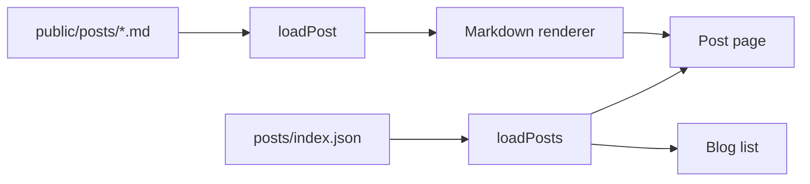

Posts are rendered by `src/components/Markdown.tsx`, which walks
[marked](https://marked.js.org)'s token stream and maps each node to a styled
React element. This page uses every feature it supports, so you can see what
you get — and so you notice if you break something.

## Frontmatter

```yaml
---
id: 3
slug: markdown-reference
title: Markdown reference — everything the renderer supports
excerpt: One or two sentences. Shown in the archive, the RSS feed, and link previews.
date: 2026-02-03
readingTime: 6
tags: ["Meta", "Reference"]
ogImage: /images/posts/markdown-reference/figure-demo.svg
---
```

`ogImage` is optional; without it, link previews fall back to the site-wide
image from `site.config.json`. Every other field is required, and the same
values go in `public/posts/index.json`.

## Headings and the table of contents

`##` and `###` headings are collected into the sticky table of contents on the
right (on screens wider than 1100px, once a post has three or more of them).
Anchors are GitHub-style slugs, so `## Headings and the table of contents`
becomes `#headings-and-the-table-of-contents` — deep links keep working as long
as you don't rename the heading.

### A third-level heading

Nests under the second-level one in the TOC, and gets its own anchor.

## Text

Regular paragraphs are set at a 68-character measure. **Bold** carries weight,
*italic* is for emphasis, `inline code` gets a subtle box, and
[links](https://example.com) are accented with an underline that thickens on
hover. External links open in a new tab automatically.

> Blockquotes are set in Newsreader italic, one size up from the body. They're
> for something worth pausing on — a quote, a warning, the sentence you want
> people to remember — not for asides.

- Unordered lists take a disc marker in the muted ink color
- Items can contain `code`, **bold**, and [links](https://example.com)
- Keep them short; a list of paragraphs should be paragraphs

1. Ordered lists work the same way
2. And number themselves
3. As you'd expect

---

A horizontal rule renders as a hairline in the border color.

## Code

Fenced blocks are highlighted by shiki. The fence label picks the grammar:

```typescript
export interface PostMeta {
  slug: string
  title: string
  date: string      // ISO, YYYY-MM-DD
  readingTime: number
  tags: string[]
}
```

Add a filename after a colon and it appears in the block's header bar, next to
the copy button:

```python:scripts/wordcount.py
from pathlib import Path

def words(path: Path) -> int:
    return len(path.read_text().split())

print(sum(words(p) for p in Path("public/posts").glob("*.md")))
```

Diff blocks get line-level backgrounds:

```diff
 export default function Navbar() {
-  const [open, setOpen] = useState(false)
+  const [open, setOpen] = useState(false)
+  const location = useLocation()
```

Unknown or omitted languages render as plain text — still monospaced, still
copyable, just not colored.

## Figures

An image alone in a paragraph becomes a figure: centered, bordered, numbered
automatically, with the alt text as its caption. Click it for a lightbox.


Post images live in `public/images/posts/<slug>/`. Reference them with an
absolute path from the site root, as above.

## Diagrams

A ```` ```mermaid ```` fence renders a [mermaid](https://mermaid.js.org)
diagram, themed to match the site and re-rendered when you toggle light/dark:



Mermaid is lazy-loaded, so posts without a diagram never pay for the bundle.

## Tables

| Feature | Component | Notes |
| --- | --- | --- |
| Syntax highlighting | `CodeBlock` | shiki, CSS-variable theme |
| Diagrams | `MermaidBlock` | lazy-loaded, theme-aware |
| Images | `FigureBlock` | auto-numbered, lightbox |
| Contents | `Toc` | scroll-spy, ≥3 headings |

Tables scroll horizontally on narrow screens rather than squashing.

## What isn't supported

Raw HTML in markdown is ignored — the renderer maps tokens to React elements
and never sets `dangerouslySetInnerHTML` on post content. If you need something
the renderer doesn't do, add a case to `renderBlocks()` in
`src/components/Markdown.tsx`; that's where every block type is handled.
